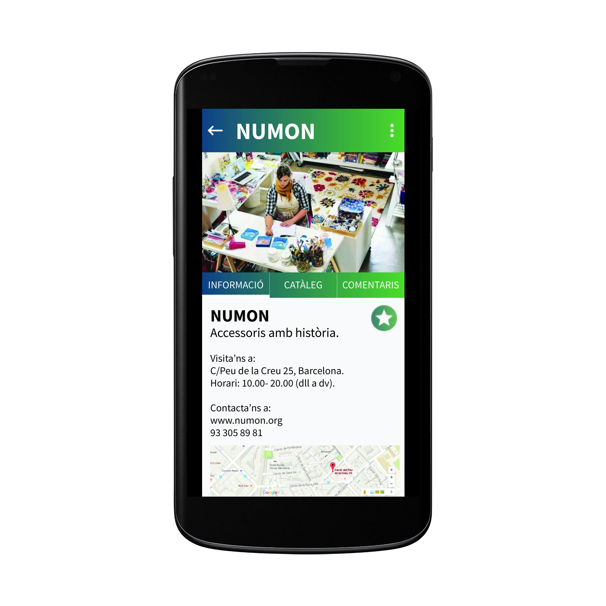
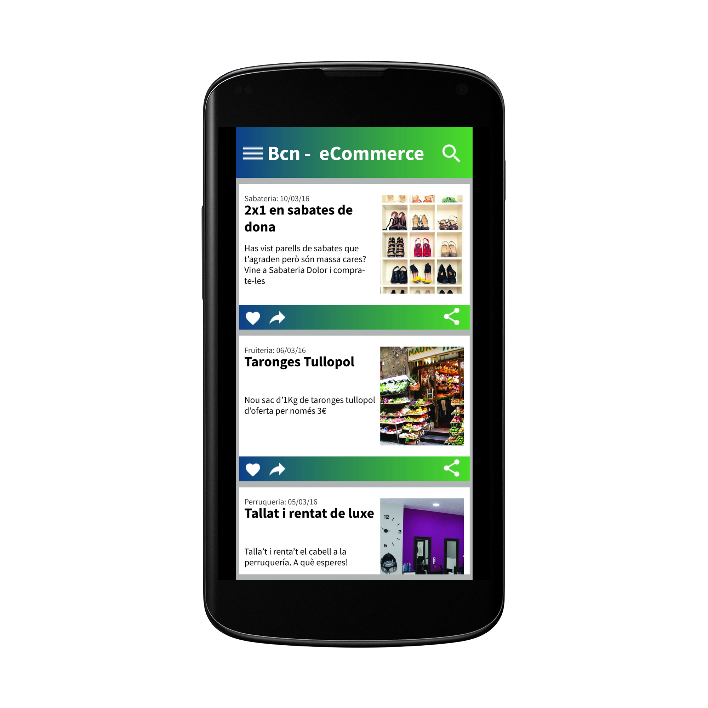
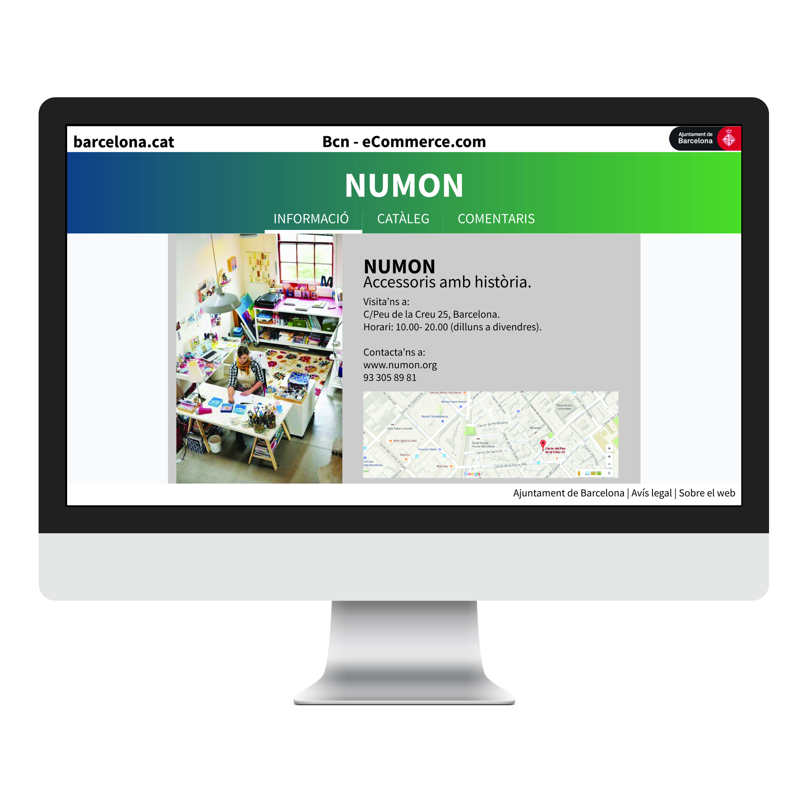
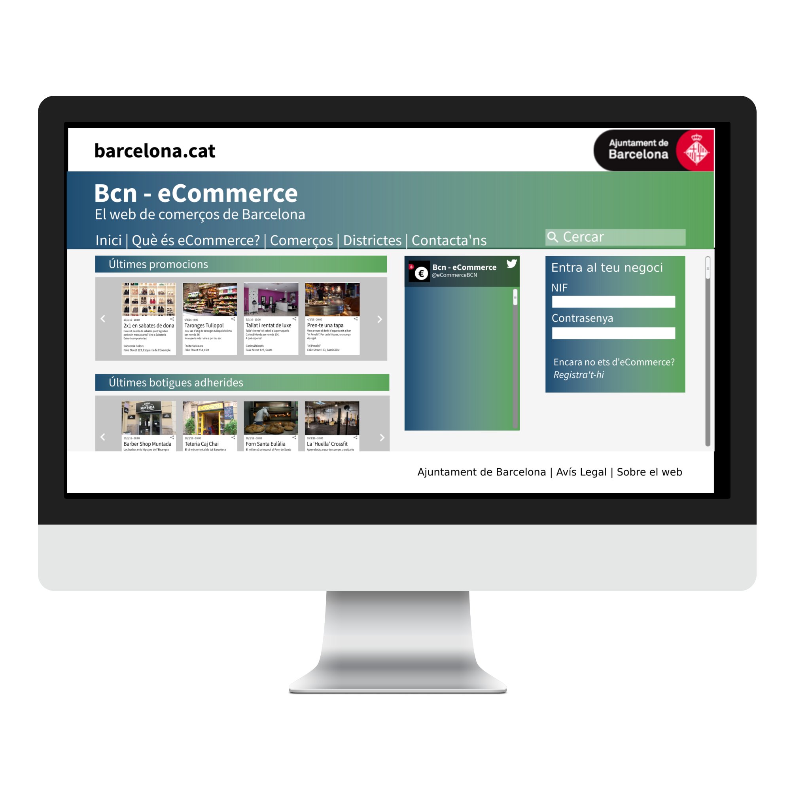

#BCN-Commerce - ESPECIFICACIÓ DE REQUISITS DEL SOFTWARE #
## 1. ESPECIFICACIÓ FUNCIONAL ##
### 1.1. Diagrama de casos d'ús

#### Paquet de gestió del comerç
- Cas d'ús UC001: - *Afegir comerç*
Fa referència a l'acció de donar-se d'alta (registrar-se) al sistema per part dels comerciants.

- Cas d'ús UC002: - *Eliminar comerç*
Fa referència a l'acció de donar-se de baixa del sistema per part dels comerciants.

- Cas d'ús UC003: - *Editar informació comerç*
Fa referència a la modificació de la informació del comerç actor.

- Cas d'ús UC004: - *Afegir oferta*
Fa referència a l'acció d'afegir una oferta nova al comerç actor

- Cas d'ús UC005: - *Eliminar oferta*
Fa referència a l'acció d'eliminar una oferta existent del comerç actor.

- Cas d'ús UC006: - *Editar informació oferta*
Fa referència a la modificació de la informació d'una oferta existent en el sistema del comerç actor.

- Cas d'ús UC007: - *Afegir producte o servei*
Fa referència a l'acció d'afegir un producte o servei al catàleg del comerç actor.

- Cas d'ús UC008: - *Eliminar producte o servei*
Fa referència a l'acció d'eliminar un producte o servei existent del catàleg del comerç actor.

- Cas d'ús UC009: - *Editar producte o servei*
Fa referència a la modificació de la informació d'un producte o servei existent en el sistema del comerç actor.

#### Paquet de gestió d'usuari
- Cas d'ús UC010: - *Afegir usuari*
Fa referència a l'acció de donar-se d'alta (registrar-se) al sistema per part dels usuaris/ciutadans.

- Cas d'ús UC011: - *Eliminar usuari*
Fa referència a l'acció de donar-se de baixa del sistema per part dels usuaris/ciutadans.

- Cas d'ús UC012: - *Editar informació usuari*
Fa referència a la modificació de la informació de l'usuari actor.

#### Paquet d'útils
- Cas d'ús UC013: - *Sol·licitar fidelització*
El client/ciutadà sol·licita a un comerç la possibilitat de convertir-se en "client fidel" del comerç amb l'objectiu de rebre bonificacions en les transaccions habituals amb el comerç.

- Cas d'ús UC014: - *Confirmar fidelització*
El comerç confirma les sol·licituds pendents de fidelització dels clients que consideri lleials al comerç.

- Cas d'ús UC015: - *Subscripció*
L'usuari/ciutadà es podrà subscriure als comerços que desitgi per rebre informació i novetats d'aquests a través de l'aplicació i/o de l'e-mail.

- Cas d'ús UC016: - *Cercar negoci per barri*
L'usuari/ciutadà podrà cercar els negocis segons el barri de la ciutat que desitgi, ordenats alfabèticament.
Aquest cas d'ús pot acumular-se amb els altres casos d'ús de cerca. Per exemple, l'usuari podrà cercar segons barri i categoria.

- Cas d'ús UC017: - *Cercar negoci per categoria*
L'usuari/ciutadà podrà cercar els negocis segons la categoria que ofereixi l'aplicació, ordenats alfabèticament.
Aquest cas d'ús pot acumular-se amb els altres casos d'ús de cerca. Per exemple, l'usuari podrà cercar segons barri i categoria.

- Cas d'ús UC018: - *Cercar negoci per proximitat*
L'usuari/ciutadà podrà cercar els negocis segons la posició que es trobi i localitzar-ne els més propers, ordenats alfabèticament.
Aquest cas d'ús pot acumular-se amb els altres casos d'ús de cerca. Per exemple, l'usuari podrà cercar segons on es trobi i categoria.

- Cas d'ús UC019: - *Afegir valoració*
L'usuari podrà valorar els comerços a través d'una puntuació numèrica i podrà afegir comentaris que seran visibles tant el comerç com els altres usuaris.

- Cas d'ús UC020: - *Eliminar valoració*
L'usuari podrà eliminar qualsevol valoració que hagi afegit prèviament a un comerç i deixarà de ser visible tant pel
comerç com pels altres usuaris.

- Cas d'ús UC021: - *Reportar valoració*
En cas que algun comentari d'una valoració contingui qualsevol mena de llenguatge ofensiu, degradant o discriminatori, la valoració podrà ser reportada per a la seva futura eliminació.

### 1.2. Descripció individual dels casos d'ús
#### Cas d'ús UC001 - *Afegir comerç* ####
El sistema mostra una llista amb els camps necessaris per donar d'alta un comerç (nom, direcció, tipus, horari, telèfon...) i altres d'optatius com una fotografia o la pàgina web si ja en té.
A continuació es mira a la base de dades si aquest comerç compleix els requisits, si els compleix, s'afegeix al sistema i es demana un usuari encarregat de mantenir aquest perfil. Si no, s'avisa de per què no i es deixa modificar els camps introduïts de forma errònia.

#### Cas d'ús UC002 - *Eliminar comerç* ####
El sistema mostra el/s comerç/os que l'usuari és administrador.
A continuació s'escull el comerç que es desitja eliminar, el sistema mostra un missatge de confirmació i a continuació s'elimina del sistema.

#### Cas d'ús UC003 - *Editar informació comerç* ####
El sistema mostra el/s comerç/os que l'usuari és administrador.
A continuació s'escull el comerç que es desitja editar.
Es mostren tots els camps que estan omplerts i els que estan buits però es poden omplir perquè són optatius.
Es permet modificar qualsevol d'aquests camps.
Quan l'usuari administrador desitja modificar els canvis es clica al botó 'guardar'.
A continuació es mira a la base de dades si la informació compleix els requisits, si els compleix, es modifica al sistema. Si no compleix els requisits, s'avisa de per què no i es deixa modificar els camps introduïts de forma errònia.
Finalment, s'envia un avís als subscriptors.

#### Cas d'ús UC004 - *Afegir oferta* ####
El sistema mostra el/s comerç/os que l'usuari és administrador.
A continuació s'escull el comerç al qual es desitja afegir oferta.
Es mostren els camps necessaris per a afegir una oferta (l'article, el tipus d'oferta (2x1,descompte, etc.), la data de finalització de l'oferta...).
A continuació es mira a la base de dades si aquesta oferta compleix els requisits, si els compleix, s'afegeix al sistema.
Si no compleix els requisits, s'avisa de per què no i es deixa modificar els camps introduïts de forma errònia.
Enviar avís als subscriptors.

#### Cas d'ús UC005 - *Eliminar oferta* ####
El sistema mostra el/s comerç/os que l'usuari és administrador.
El sistema mostra la/les oferta/es que té el comerç.
A continuació s'escull l'oferta que es desitja eliminar, el sistema mostra un missatge de confirmació i a continuació s'elimina del sistema.
Finalment, s'envia un avís als subscriptors.

#### Cas d'ús UC006 - *Editar informació oferta* ####
El sistema mostra el/s comerç/os que l'usuari és administrador.
A continuació s'escull el comerç que es desitja editar.
Es mostren totes les ofertes que hi ha actualment.
A continuació s'escull l'oferta que es desitja editar.
Es mostren tots els camps que estan omplerts i els que estan buits però es poden omplir perquè són optatius.
Es permet modificar qualsevol d'aquests camps.
Quan l'usuari administrador desitja modificar els canvis es clica al botó 'guardar'.
A continuació es mira a la base de dades si aquesta oferta compleix els requisits, si els compleix, es modifica al sistema.
Si no compleix els requisits, s'avisa de per què no i es deixa modificar els camps introduïts de forma errònia.
Finalment, s'envia un avís als subscriptors.

#### Cas d'ús UC007 - *Afegir producte o servei* ####
El sistema mostra el/s comerç/os que l'usuari és administrador.
A continuació s'escull el comerç que es desitja afegir producte.
Es mostren els camps necessaris per a afegir un producte (article, preu).
A continuació es mira a la base de dades si aquesta oferta compleix els requisits, si els compleix, s'afegeix al sistema.
Si no compleix els requisits, s'avisa de per què no i es deixa modificar els camps introduïts de forma errònia.
Finalment, s'envia un avís als subscriptors.

#### Cas d'ús UC008 - *Eliminar producte o servei* ####
El sistema mostra el/s comerç/os que l'usuari és administrador.
El sistema mostra el/s producte/s que té el comerç.
A continuació s'escull el producte que es desitja eliminar, el sistema mostra un missatge de confirmació i a continuació s'elimina del sistema.
Finalment, s'envia un avís als subscriptors.

#### Cas d'ús UC009 - *Editar producte o servei* ####
El sistema mostra el/s comerç/os que l'usuari és administrador.
A continuació s'escull el comerç que es desitja editar.
Es mostren tots els productes que hi ha actualment.
A continuació s'escull el producte que es desitja editar.
Es mostren tots els camps que estan omplerts i els que estan buits però es poden omplir perquè són optatius.
Es permet modificar qualsevol d'aquests camps.
Quan l'usuari administrador desitja modificar els canvis es clica al botó 'guardar'.
A continuació es mira a la base de dades si aquest producte compleix els requisits, si els compleix, es modifica al sistema.
Si no compleix els requisits, s'avisa de per què no i es deixa modificar els camps introduïts de forma errònia.
Finalment, s'envia un avís als subscriptors.

#### Cas d'ús UC010 - *Afegir usuari* ####
Es mostren els camps necessaris per a afegir un usuari (nom, cognom, e-mail, pseudònim) i altres camps optatius com una fotografia.
A continuació es mira a la base de dades si aquest usuari compleix els requisits, si els compleix, s'afegeix al sistema.
Si no compleix els requisits, s'avisa de per què no i es deixa modificar els camps introduïts de forma errònia.

#### Cas d'ús UC011 - *Eliminar usuari* ####
L'usuari clica el botó eliminar, es mostra un missatge de confirmació i si s'accepta, s'elimina l'usuari.

#### Cas d'ús UC012 - *Editar informació usuari* ####
Es mostren tots els camps que estan omplerts i els que estan buits però es poden omplir perquè són optatius.
Es permet modificar qualsevol d'aquests camps.
Quan l'usuari desitja modificar els canvis es clica al botó 'guardar'.
A continuació es mira a la base de dades si aquest usuari compleix els requisits, si els compleix, es modifica al sistema.
Si no compleix els requisits, s'avisa de per què no i es deixa modificar els camps introduïts de forma errònia.

#### Cas d'ús UC013 - *Sol·licitar fidelització* ####
L'usuari està a la pantalla d'un comerç.
Clica el botó de fidelitzar.
El sistema guarda la petició i envia un avís a l'administrador del comerç, que l'acceptarà o no.

#### Cas d'ús UC014 - *Confirmar fidelització* ####
L'usuari administrador del comerç rep un avís, quan l'obri, té dues opcions, acceptar-la o no.
Depenen de l'opció escollida l'usuari que fa la petició serà fidel o no.

#### Cas d'ús UC015 - *Subscripció* ####
L'usuari està a la pantalla d'un comerç.
Clica el botó de subscripció.
El sistema guarda la petició i cada cop que hi hagi una novetat rebrà un avís.

#### Cas d'ús UC016 - *Cercar negoci per barri* ####
L'usuari selecciona el barri d'una llista i es mostra una llista amb tots els negocis del sistema situats en aquest barri.
Es pot afegir a aquesta cerca qualsevol categoria i filtraria per tots els camps escollits.

#### Cas d'ús UC017 - *Cercar negoci per categoria* ####
L'usuari selecciona la categoria d'una llista i es mostra una llista amb tots els negocis del sistema d'aquesta categoria.
Es pot afegir a aquesta cerca qualsevol barri i filtraria per tots els camps escollits.

#### Cas d'ús UC018 - *Cercar negoci per proximitat* ####
L'usuari accepta la petició de saber la seva posició actual.
El sistema mostrarà tots els comerços més pròxims i ordenats per la distància la qual estan de l'usuari.
Es pot afegir a aquesta cerca la cerca per categoria i filtraria per tots els camps escollits.

#### Cas d'ús UC019 - *Afegir valoració* ####
L'usuari està a la pantalla d'un comerç.
Clica l'opció de valoracions.
Quan està al final de la vista escriu al requadre que hi ha i clica el botó enviar.
El sistema guarda la valoració i l'afegeix a les valoracions del comerç.

#### Cas d'ús UC020 - *Eliminar valoració* ####
L'usuari està a la pantalla d'un comerç.
Clica l'opció de valoracions.
Quan selecciona una valoració seva i clica el botó eliminar el sistema esborra a les valoracions del comerç la seleccionada.

#### Cas d'ús UC021 - *Reportar valoració* ####
L'usuari està a la pantalla d'un comerç.
Clica l'opció de valoracions.
Selecciona una valoració i clica el botó reportar (perquè li sembla ofensiva).
El sistema avisa als administradors del sistema i si es cal, s'esborra a les valoracions del comerç el comentari seleccionat.

## 2. ESPECIFICACIÓ NO FUNCIONAL ##
### Usabilitat - NFR001
##### Descripció
Sistema fàcil i intuïtiu per a qualsevol persona que vulgui utilitzar-lo. Per tant, una part visual fàcil i intuïtiva.
##### Justificació
Perquè una aplicació sigui usable, la gent que la vulgui utilitzar ha de saber utilitzar-la de forma ràpida i poder fer tot allò que vol sense perdre molt de temps clicant a botons per a trobar l'opció que ell vol.
##### Font
Usuaris
##### Criteris de validació
Els usuaris la puntuen bé i no rebem queixes de difícil d'utilitzar o que no saben utilitzar-la.

### Eficiència - NFR002
##### Descripció
Sistema ràpid, que no trigui molt a fer els casos d'ús.
##### Justificació
Un sistema lent pot provocar desesperació a l'usuari i que deixi d'utilitzar l'aplicació.
##### Font
Usuaris
##### Criteris de validació
Els usuaris la puntuen bé i no rebem queixes d'aplicació lenta.

### Portable - NFR003
##### Descripció
Sistema apte per a diferents Sistemes Operatius i resolucions de pantalla.
##### Justificació
Si es vol que el sistema tingui una aplicació i una pàgina web, òbviament haurà de ser compatible amb diferents resolucions (mòbils, tauletes, ordinadors) i diferents Sistemes Operatius (Android, IOS, Windows Phone...).
##### Font
Ajuntament
##### Criteris de validació
Es pot utilitzar en totes les plataformes on s'ha definit que haurà de funcionar.

### Sostenible - NFR004
##### Descripció
Sistema que es pugui mantenir com a mínim durant 4 anys i poder-lo actualitzar còmodament.
##### Justificació
Com que s'inverteix des de l'ajuntament en aquest sistema, es desitja que es pugui mantenir i actualitzar fàcilment i sense massa inversions.
##### Font
Ajuntament
##### Criteris de validació
Seguir una sèrie de criteris i/o patrons de disseny que comportin un fàcil manteniment.

### Segur - NFR005
##### Descripció
Sistema que no es pugui entrar externament i agafar dades personals dels clients o comerços.
##### Justificació
Aquest sistema tindrà informació privada, per tant, s'ha de cuidar que aquestes dades estiguin segures.
##### Font
Ajuntament i Usuaris
##### Criteris de validació
Contractar a experts en seguretat informàtica que provin la seguretat.

## 3. MOCK UP 

