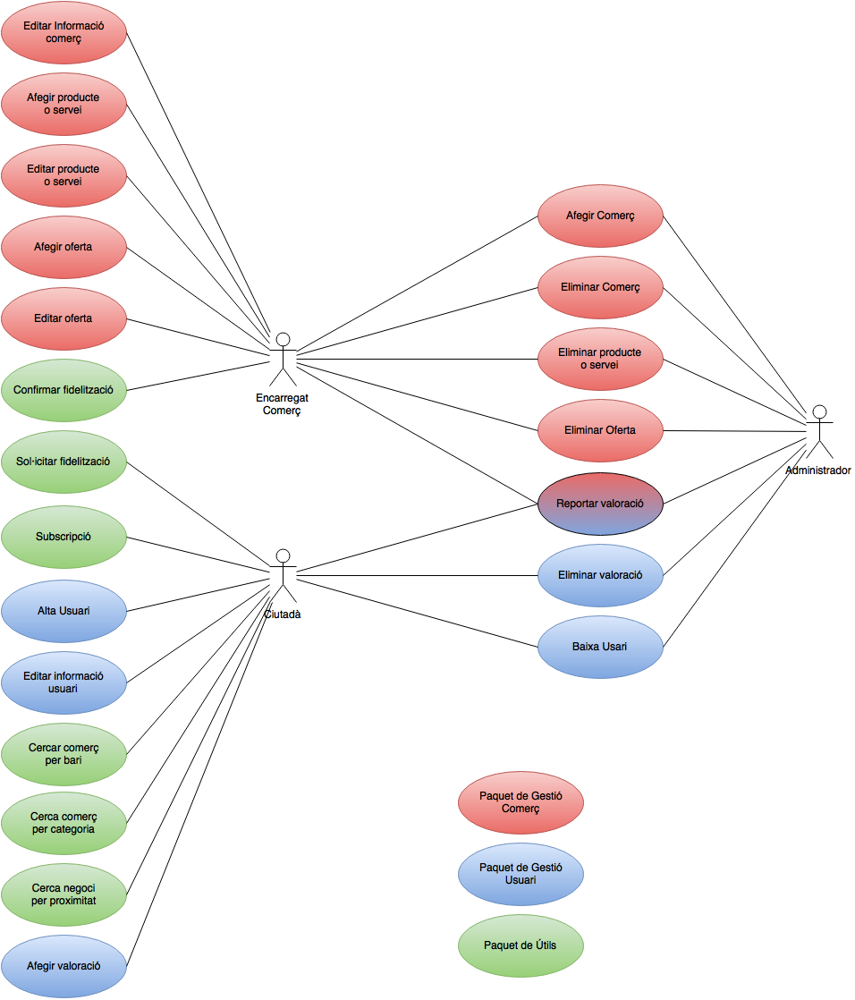

# Bcn-eCommerce - ESPECIFICACIÓ DE REQUISITS DEL SOFTWARE #

> El propòsit del document d'especificació de requisits és presentar el detall dels requisits del sistema. És un document evolutiu, atès que el nombre i detall dels requisits creix a mida que s'avança en el projecte

> Donat el principi de "dirigit per casos d'ús", l'especificació funcional pendrà la forma d'una especificació per casos d'ús

> Recordem que els documents de visió i cas de negoci tindran força informació sobre el producte, que aquí no repetirem

## 1. ESPECIFICACIÓ FUNCIONAL ##

### 1.1. Diagrama de casos d'ús

#### Paquet de gestió clients
- Cas d'ús UC001: - *Alta negoci*:  
Fa referència a l'acció de donar-se d'alta (registrar-se) a l'aplicació per part dels comerciants.

- Cas d'ús UC002: - *Baixa negoci*:  
Fa referència a l'acció de donar-se de baixa de l'aplicació per part dels comerciants.

- Cas d'ús UC003: - *Alta usuari*:  
Fa referència a l'acció de donar-se d'alta (registrar-se) a l'aplicació per part dels clients/ciutadans.

- Cas d'ús UC004: - *Baixa usuari*:  
Fa referència a l'acció de donar-se de baixa de l'aplicació per part dels clients/ciutadans.

#### Paquet gestió comerç
- Cas d'ús UC005: - *Alta oferta*:  
Afegir una oferta del negoci al sistema.  

- Cas d'ús UC006: - *Alta promoció*:  
Afegir una promoció del negoci al sistema.  

- Cas d'ús UC007: - *Editar informació botiga*:  
Poder canviar la informació del comerç sempre que es desitgi.

- Cas d'ús UC008: - *Editar catàleg*:  
Modificar la informació de qualsevol producte o servei que el negoci o comerç ofereixi

#### Paquet útils usuari
- Cas d'ús UC009: - *Fidelització*:  
El negoci decideix fidelitzar un client oferint-li bonificacions en les
seves transaccions habituals.

- Cas d'ús UC010: - *Subscripció*:  
descripció

- Cas d'ús UC011: - *Cercar negoci*:  
descripció

- Cas d'ús UC012: - *Afegir valoració*:  
descripció

### 1.2. Descripció individual dels casos d'ús

> Un per un, es descriuen els casos d'ús introduïts a la subsecció 1.1. Com ja s'ha dit adalt, els casos d'ús s'aniran defining paulatinament

#### Cas d'ús UC001 - *nom* ####

> Descripció del primer cas d'ús. Si bé en una especificació "de veritat", escriuriem el curs rellevant d'esdeveniments, excepcions, etc., aquí ens conformem amb una descripció més "lleugera"

#### Cas d'ús UC002 - *nom* ####

> etc.

## 2. ESPECIFICACIÓ NO FUNCIONAL ##

> Descriure en més detall els requisits no funcionals que han sortit al document de visió, intentant fer-los el més quantificables possible. Basar-se en alguna plantilla d'especificació de requisits

### Usabilitat - NFR001
##### Descripció
Sistema fàcil i intuïtiu per a qualsevol persona que vulgui utilitzar-lo. Per tant, una part visual fàcil i intuitiva.
##### Justificació
Per a que una aplicació sigui usable, la gent que la vulgui utilitzar ha de saber utilitzar-la de forma ràpida i poder fer tot allò que vol sense perdre molt de temps clicant a botons per a trobar la opció que ell vol.
##### Font
Usuaris
##### Criteris de  validació
Els usuaris la puntuan bé i no rebem queixes de díficil de utilitzar o que no saben utilitzarla.  

### Eficiència - NFR002
##### Descripció
Sistema ràpid, que no trigui molt a fer els cassos d'ús.
##### Justificació
Un sistema lent pot provocar desesperació a l'usuari i que deixi de utilitzar la aplicació. 
##### Font
Usuaris
##### Criteris de  validació
Els usuaris la puntuan bé i no rebem queixes d'aplicació lenta.

### Portable - NFR003
##### Descripció
Sistema apte per a diferents Sistemes Operatius i resolucions de pantalla.
##### Justificació
Si es vol que el sistema tingui una aplicació i una pàgina web, obviament haurà de ser compatible amb diferents resolucions (mòvils, tablets, ordinadors) i diferents Sistemes Operatius (Android, IOS, Windows Phone...).
##### Font
Ajuntament
##### Criteris de  validació
Es pot utilitzar en totes les plataformes on s'ha definit que haurà de funcionar.

### Mantenible - NFR004
##### Descripció
Sistema que es pugui mantenir durant molts anys i poder-lo actualitzar còmodament.
##### Justificació
Ja que s'inverteix des de l'ajuntament en aquest sistema, es desitja que es pugui mantenir i actualitzar fàcilment i sense masses inversions.
##### Font
Ajuntament
##### Criteris de  validació
Segueix una sèrie de criteris que confirmin la independència entre classes (entre altres coses).

### Segur - NFR005
##### Descripció
Sistema que no es pugui entrar externament i agafar dades personals dels clients o comerços.
##### Justificació
Aquest sistema tindrà informació privada, per tant, s'ha de cuidar que aquestes dades estiguin segures.
##### Font
Ajuntament i Usuaris
##### Criteris de  validació
Contractar a experts en seguretat informàtica que probin la seguretat.
