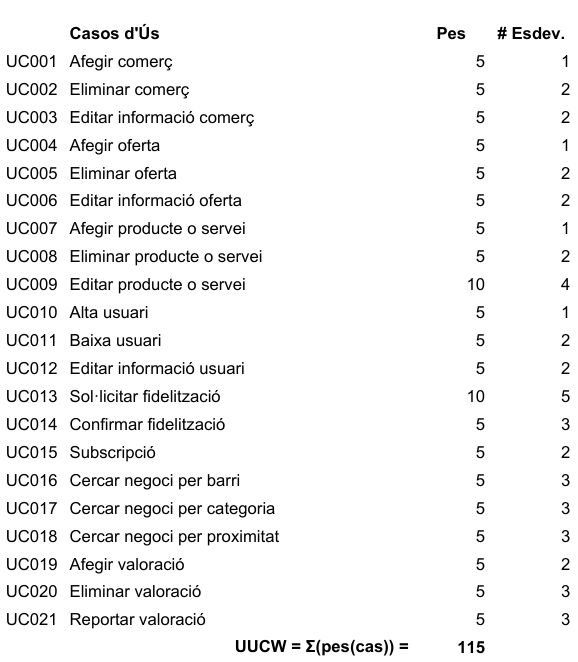
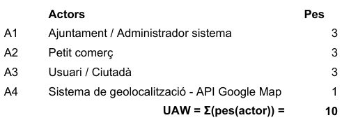
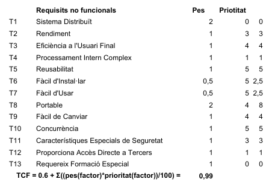
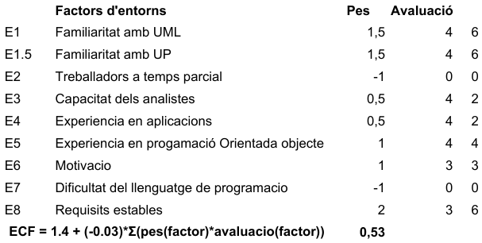
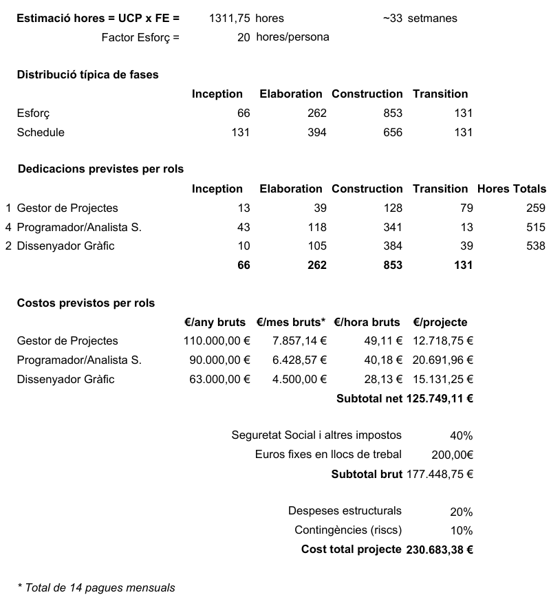

#BCN-Commerce - PLA DE DESENVOLUPAMENT DE SOFTWARE #

## 1. ORGANITZACIÓ I EQUIP ##
Som el departament Smartcities de l'Ajuntament de Barcelona.
L'equip que el formem som un grup de 7 persones - un gestor del projectes, quatre programadors seniors i per últim, dos dissenyador gràfic -.
El rol del gestor és planificar el projecte i assignar les tasques a cada membre del grup. Per altra banda, els desenvolupadors són els experts en web i mòbil. Per últim, el dissenyador gràfic serà l'encarregat de dissenyar totes les interfícies gràfiques de l'aplicació així com tenir en compte conceptes d'usabilitat. 

## 2. PLA DE PROJECTE ##
### 2.1. Estimació d'esforç ###
Per a fer aquests càlculs ens hem ajudat de l'eina Excel. Per calcular les hores del projecte partim de l'UCP i del PF. S'ha de dir que és una estimació, és a dir, no és un temps definitiu. El PF és el factor d'esforç per punt de cas d'ús. Com bé es veu a l'Excel, el FP és 20 hores/persona.
Ara bé, pel càlcul de l'UCP, es té en compte l'UUCW, l'UAW, el TCF i per últim, l'ECF. El nostre UCP és de 65,5875.

L'UUCW fa refèrencia als casos d'ús del sistema i al pes d'aquests, així com els esdeveniments externs. El nostre UUCW és de 115.

L'UAW fa referència als actors, qualsevol entitat externa que interaccioni amb ells, tenint en compte el seu pes un altre cop.El nostre UAW és de 10.

El TCF fa referència a la complexitat tècnica, on cal fixar el pes i la prioritat. És un percentatge, que es calcula com la suma dels pesos per la prioritat d'aquests dividit entre 100. A tot això se li suma un 0,6. El nostre TCF és de 0,99.

Per últim tenim l'ECF, que són els factors d'entorn, que són factors relacionals al projecte i context, però que poden influir. Es calcula com la suma dels pesos dels factors per la seva avaluació, multiplicat per un factor de -0,03 i tot sumat a 1,4. El nostre ECF és de 0,53.

Hem consultat les taules per saber els pesos de cada cosa, així com tot el necessari per fer l'estudi i el càlcul de l'UCP.

### 2.2. Estimació de cost ###
El cost total del projecte són 230.683,38 euros. Aquest cost el subvidim en els costos del Gestor de Projectes, dels quatre Programadors i Analistes Software i per últim, dels dos Dissenyador Gràfics. Hem fet una estimació de les hores que dedicarà cadascú d'ells en les fases del projecte tal i com es pot veure a l'Excel. 
El Gestor representa 12.718,75 euros del projecte, els Programadors 20.691,96 euros i els Dissenyadors 15.131,25 euros. Això és un subtotal net	d'uns 126.000 euros, que són uns 178.000 euros bruts (parlant de xifres rodones). Tenint en compte les contingències i les despeses estructurals, ens queda un cost total de 30.683,38 euros.

## 4. PLA DE FASES ##
Seguint els percentatges típics de la taula següent, hem adaptat després als nostres casos d'ús.

### 4.1 Taula percentatges típics

|  | INCEPTION | ELABORATION | CONSTRUCTION | TRANSITION |
|--------|--------|--------|--------|--------|
| Identificat | ~60% | ~80% | 100% | 100% |
| Esbossat | 50% | 80% | 100% | 100% |
| Refinat | 10% | 45% | 100% | 100% |
| Analitzat | 0% | 35% | 100% | 100% |
| Complet | 0% | 0% | 100% | 100% |

### 4.2 Taula pla de fases

|| INCEPTION |ELABORATION|CONSTRUCTION|TRANSITION|
|--------|--------|--------|--------|--------|
|Afegir comerç|Refinat|Analitzat|Complet|Complet|
|Eliminar comerç|Esbossat|Esbossat|Complet|Complet|
|Editar informació comerç|Esbossat|Analitzat|Complet|Complet|
|Afegir oferta|Esbossat|Analitzat|Complet|Complet|
|Eliminar oferta|Esbossat|Esbosat|Complet|Complet|
|Editar informació oferta|Esbossat|Analitzat|Complet|Complet|
|Afegir producte o servei|Refinat|Analitzat|Complet|Complet|
|Eliminar producte o servei|Esbossat|Esbossat|Complet|Complet|
|Editar producte o servei|Esbossat|Analitzat|Complet|Complet|
|Alta usuari|Refinat|Analitzat|Complet|Complet|
|Baixa usuari|Esbossat|Esbossat|Complet|Complet|
|Editar informació usuari|-|Esbossat|Complet|Complet|
|Sol·licitar fidelització|Identificat|Refinat|Complet|Complet|
|Confirmar fidelització|-|-|Complet|Complet|
|Subscripció|Identificat|Refinat|Complet|Complet|
|Cercar negoci per barri|-|Esbossat|Complet|Complet|
|Cercar negoci per categoria|Identificat|Esbossat|Complet|Complet|
|Cercar negoci per proximitat|-|-|Complet|Complet|
|Afegir valoració|-|Esbossat|Complet|Complet|
|Eliminar valoració|-|-|Complet|Complet|
|Reportar valoració|-|-|Complet|Complet|

Les fases del projecte, com hem vist, es divideixen en la d'Inception, Elaboration, Construction i Transition.

En la fase d'Inception els objectius principals són: definir la visió, determinar l'abast del projecte, crear el cas de negoci, definir l'arquitectura candidata i crear el pla de desenvolupament software.
Pel que fa a les iteracions tenim una iteració. A més a més, l'esforç d'aquesta fase no juga el paper més important del projecte, ja que és la fase que requereix menys esforç de les quatre.
Els documents a entregar són la visió, el cas de negoci, l'arquitectura general, el pla de desenvolupament software, etc.
Dates de la fase: 1/03/2016 - 17/03/2016

En la fase d'Elaboration els objectius principals els dividirem per iteració, ja que aquesta fase en té dues.
En la primera iteració els objectius principals són: instal·lar i provar l'arquitectura, validar els requisits i implementar els casos d'ús prioritaris. Pel que fa a la segona iteració, els objectius principals són: mitigar riscs arquitectònics, completar la prova de l'arquitectura de la primera iteració i implementar casos d'ús addicionals.
En aquesta fase l'esforç juga un paper força important respecte les demés fases, encara que no és la fase que s'hi dedica més esforç.
Els documents a entregar són la implementació dels principals casos d'ús, els requisits del sistema validats així com els riscs d'aquest.
Dates de la fase: 18/03/2016 - 5/05/2016

En la fase de Construction els objectius principals els dividirem també per iteració, ja que aquesta fase en té tres.
En la primera iteració els objectius principals són: descriure casos d'ús addicionals, dissenyar subsistemes addicionals, integrar el producte i validar l'estat i implementar casos d'ús i subsistemes. La segona iteració i la tercera els objectius són els mateixos (es una fase bastant costosa a nivell d'esforç, la que més), excepte la tercera iteració que a més a més té com a objectiu planificar la versió beta i suport a l'usuari.
Els documents a entregar són el programa (codi, documentació per a usuaris, etc.).
Dates de la fase: 6/05/2016 - 25/07/2016

En la fase de Transition els objectius principals són: desplegar beta en client, obtenir i processar feedback, finalitzar el suport al client i l'entrega al clent. Aquesta fase té una iteració. L'esforç d'aquesta fase un altre cop no és la fase que més esforç necessita. 
Els documents a entregar són el programa ja funcionant correctament en funció de les necessitats del client, havent revisar el feedback rebut. 
Dates de la fase: 26-07-2016 - 11/08/2016

