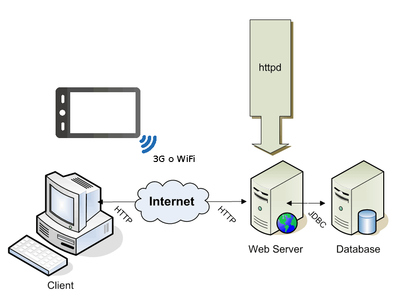

# BCN-Commerce - VISIÓ #
 
## 1. INTRODUCCIÓ ##

En aquest document presentarem el problema que el nostre problema pretén afrontar,
tot mostrant les possibles parts interessades i les seves responsabilitats 
en el sistema.  
Presentem també una descripció del producte amb un esquema de la seva perspectiva, 
les seves funcionalitats a priori i els supòsits de bon funcionament.  
Finalment esmentem la dependència del nostre sistema sobre els altres sistemes i
els requisits no funcionals que pretenem que el nostre sistema també satisfaci.  

## 2. EL PROBLEMA ##

Donades les dificultats que els petits negocis presenten per donar-se a conèixer a causa de la immensa captació de clients de les grans superfícies, oferim un sistema que permetrà al comerç de proximitat superar aquestes barreres i promocionar-se.  
Els negocis rebràn un espai on publicar-se, on donar-se a conèixer i on gestionar la seva empresa.  
Per als ciutadans de Barcelona els oferim un racó d'informació on poder consultar ofertes i notícies en lo referent a les botigues o comerços del barri, sent un punt de referència i d'informació.  
En alguns districtes de Barcelona la vida de barri està en desús i aquest sistema pretèn incrementar-la de nou i fer florir la activitat econòmica tot donant una imatge de ciutat viva.  

## 3. PARTS INTERESSADES ##

1. *Petits comerços*.  
Representa una part del principals interessats en l'aplicació.  
El seu paper en l'aplicació es publicitar-se en els seus espais i que proporcionar ofertes i promocions.  

2. *Ciutadà de Barcelona*.  
Respresenta l'altre part dels principals interessats en l'aplicació.  
La responsabilitat d'aquesta part recau en l'ús d'aquest sistema per informar-se i fidelitzar-se amb els negocis més pròxims.  

3. *Ajuntament de Barcelona*.  
La creació d'aquesta aplicació oferirà prestigi i bona imatge a l'ajuntament ja que és el propi departament de *smartcities* qui s'encarrega de la creació d'aquest sistema.  
Per un bon funcionament del sistema caldrà que l'Ajuntament de Barcelona doni suport als comerciants per usar aquest sistema, ja sigui suport orientatiu, suport legal, suport tecnològic...  

4. *Competència*.
Tots aquells que no formin part del sistema poden rebre un impacte econòmic i social important - ja siguin grans superfícies com petits comerços que no vulguin participar en el projecte -.  
No requereix cap responsabilitat per part d'ells per a què el sistema funcioni.  

## 4. EL PRODUCTE ##
 
El nostre producte consisteix en una aplicació mòbil, tant per a Android, IOS i Windows Phone. A més a més, comptarà amb el suport d'una pàgina web, útil sobretot pels comercials.
Pel que fa a les capacitats del producte, volem apropar el comerç de proximitat al món tecnològic per tal d'impulsar aquest sector, així com satisfer als ciutadans. Centrant-nos
en dues vessants; els comerciants i els ciutadans. Pel que fa als comerciants, serà una plataforma que els hi permetrà publicitar-se, anunciar ofertes i descomptes, donar opció als
ciutadans de fidelitzar-se a la seva botiga a canvi d'uns certs avantatges pel client.
Pel que fa al client, el sistema comptarà amb un bon sistema de filtratge, per tal d'escollir les botigues que més l'interessi, tant a nivell ubicacional com a nivell categorial.
També tindràn l'opció de subscriure's a una botiga i rebre notificacions cada cop que hi hagi noves notícies, així com valorar aspectes de la botiga.
Els supòsits de funcionament són un Smartphone amb un dels Sistemes Operatius esmentats abans i connexió a Internet. El sistema també tindrà dependències amb Google Maps i amb el 
servei d'emmagatzematge web.

### 4.1. Perspectiva del producte ###

El producte que volem dissenyar és un sistema d'inforació que consisteix en una app per a mòbil, que anuncia serveis dels petits comerços de Barcelona. A més a més, tindrà una
pàgina web que fara més fàcil la publicitat dels comerciants, tot i que igualment contindrà totes les funcionalitats de l'app. 
 

### 4.2. Descripció del producte ###

1. *Esplai publicitari*. Tot petit comerç de Barcelona es podrà anunciar a l'app sempre que compleixi tots els requisits i condicions demanats per l'Ajuntament(ex. dónar opció als clients
de fidelitzar-se a canvi de descomptes).
2. *Servei d'ofertes i promocions*. Tots els comerços tindran l'opció d'anunciar les ofertes i promocions especials per tal d'informar als clients.
3. *Servei de catàleg*. El comerciant podrà exposar el catàleg dels seus productes o serveis a l'app de tal forma que el client pugui veure de qué es tracta aquell comerç.
4. *Servei fidelització*. Els usuaris podran fidelitzar-se a una botiga a canvi de rebre notificacions d'aquesta i així tenir algun descompte en alguna promoció.
5. *Categories*. L'app comptarà amb un filtratge per categories (sabates, roba, electrònica...) per tal de facilitar la búsqueda als clients.
6. *Servei de valoració*. Els clients podran valorar el tracte rebut o la qualitat dels productes.
7. *Servei de subscripció*. Els clients podran subscriure's a una categoria per tal de rebre notificacions sobre allò.
8. *Servei de login*. Per a poder fer servir l'app tant l'usuari com el comerciant tindran un servei de Log In, perquè l'app sigui individualitzada (subscripció, fidelització...).
 
### 4.3. Supòsits de funcionament ###

1. *Connexió Internet*. El nostre sistema guardarà la informació en una base de dades en un servidor i per tal de connectar-se a aquest, es necessitarà Internet.
2. *Smartphone, tablet o ordinador*. El sistema consisteix en una app i una pàgina web, per tant només es necessita d'Smartphone, tablet o ordinador. 
 
### 4.4. Dependències sobre altres sistemes ###

1. *Google Maps*. Per tal de situar les botigues, ja sigui per barris o per districtes, utilitzarem el Software de Google Maps ja que ens sembla un suport molt complet i útil, a més
que és conegut per la majoria dels usuaris.
2. *Servei de emmagatzematge web*. El sistema guarda molta informació, per tant, necessitarà d'una Base de Dades i un domini d'Internet per tal de garantir la segureta i unicitat del 
sistema.
  
### 4.5. Altres requisits ###

[1]  

1. *Usabilitat*. El sistema ha de ser molt usable, és a dir, fàcil i intuïtiu per a qualsevol persona que vulgui utilitzar aquest servei. Per tant, la part visual/gràfica ha de ser una eina d'ajuda i testejada per una variada mostra d'usuaris per tal que sigui satisfactòria pels ciutadans.
2. *Eficiència*. En el nostre cas, no és el requisit més important, però la eficiència és un terme a tenir en compte sempre de cara a l'usuari.
3. *Portable*. Òbviament, com el sistema està fet per diferents Sistemes Operatius i resolucions de pantalla, haurà de ser portable.
4. *Mantenible*. Si volem que l'app sigui utilitzada durant mols anys, haurà de ser altament mantenible per facilitar el treball en un futur.
5. *Segur*. Com hem dit és una aplicació personal, per tant, la segureta és un requisit a tenir en compte.

## 5. RECURSOS ##

[1](https://es.wikipedia.org/wiki/Requisito_no_funcional)

